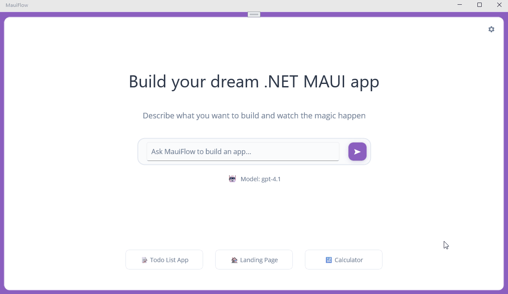

# 🌊 MauiFlow – Build Your Dream .NET MAUI App

**MauiFlow** is a developer productivity tool that helps you bootstrap complete .NET MAUI apps with AI-powered scaffolding.
Simply describe the app you want to build, and MauiFlow generates the code for you.



## 🚀 Getting Started

Clone the repo and build MauiFlow:

```
git clone https://github.com/yourname/MauiFlow.git
cd MauiFlow
dotnet build
```

Run it:

```
dotnet run --project MauiFlow
```

## 🧑‍💻 Usage

Run the tool and type what you want to build:

> a scientific calculator

## 🤝 Contributing

Contributions are welcome!

* Fork the repo
* Create a feature branch
* Submit a PR 🎉

## 📜 License

Licensed under the MIT License.